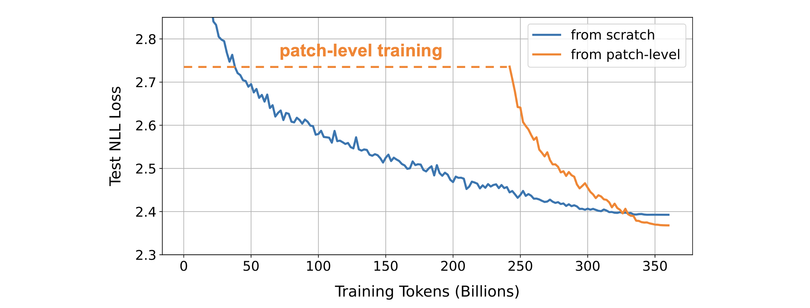

# Patch-Level Training for Large Language Models

This repo contains the code for our paper [Patch-Level Training for Large Language Models](https://arxiv.org/pdf/2407.12665).

Patch-level training is an efficient training approach for large language models (LLMs), in which models read training data in patches and learn to predict the next patch. Following this, a small amount of training data is used to adjust the model to the token-level. This approach can achieve an even lower loss in comparison with training from scratch, while reducing training costs by half.

## Usage

The implementation of patch-level training is quite straightforward, with only 10 lines of core code – feel free to directly incorporate it into your LLM training code. Our implementation is based on the LLaMA model [modeling_llama.py](https://github.com/shaochenze/PatchTrain/blob/main/modeling_llama.py), with the primary changes as follows:

### Model Input
```python
884    num_patches = seq_length // self.patch_size
885    inputs_embeds = inputs_embeds.view(batch_size, num_patches, self.patch_size, -1).mean(2)
886    position_ids = position_ids[:, :num_patches]
```

### Loss Calculation
```python
1058    shift_logits = logits[..., :-1, :].reshape(-1, self.config.vocab_size)
1059    shift_labels = labels[..., self.patch_size:].reshape(-1, self.patch_size)
1060    loss_fct = CrossEntropyLoss()
1061    loss = 0
1062    for i in range(self.patch_size):
1063        loss = loss + loss_fct(shift_logits, shift_labels[:, i])
1064    loss = loss / self.patch_size
```

## Example

We provide an example here for quick replication. Required environment: transformers>=4.34.

Due to copyright issues, the pile dataset is not publicly available now. An alternative is [pile-uncopyrighted](https://huggingface.co/datasets/monology/pile-uncopyrighted), which contains approximately 25% fewer tokens than pile. First, run the following script to download and pre-process the pile-uncopyrighted dataset, getting ~270B tokens:

```bash
bash get_data.sh
```

Next, train a Transformer with 370M parameters on the pile-uncopyrighted dataset. Run the following script for token-level training:

```bash
bash run_token.sh
```

Run the following script to perform patch-level training with a patch size of K=4 on 180B tokens, followed by token-level training on 90B tokens.

```bash
bash run_patch.sh
```

In practice, the acceleration rate of patch-level training is lower than the patch size K. This is primarily due to the time consumed in data loading and processing, especially the tokenization takes a lot of time. The acceleration rate will be much closer to K if the streaming mode is disabled.

### Loss Curves

Below are the loss curves obtained from our training on the Pile dataset (360B tokens), provided for reference.


## Citation
If you find the resources in this repository useful, please cite as:
```
@article{shao2024patch,
  title={Patch-Level Training for Large Language Models},
  author={Shao, Chenze and Meng, Fandong and Zhou, Jie},
  journal={arXiv preprint arXiv:2407.12665},
  year={2024}
}
```
